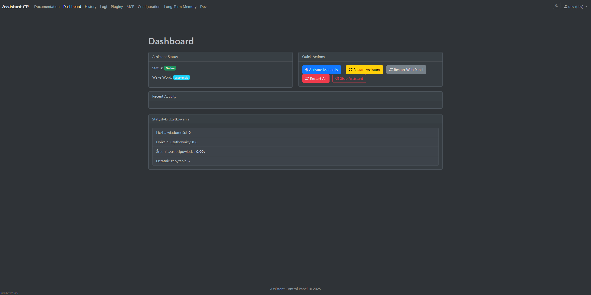

# Asystent User Guide

This guide helps you navigate and use all the features of the Asystent AI assistant system.

## Table of Contents

1. [Introduction](#introduction)
2. [Getting Started](#getting-started)
3. [Web UI Interface](#web-ui-interface)
4. [Voice Interaction](#voice-interaction)
5. [System Configuration](#system-configuration)
6. [Long-term Memory Management](#long-term-memory-management)
7. [Multilingual Support](#multilingual-support)
8. [Plugins and Extensions](#plugins-and-extensions)
9. [Troubleshooting](#troubleshooting)

## Introduction

Asystent is an AI assistant system designed to help you with various tasks through natural language interaction. It supports both voice and text-based interfaces and includes a web control panel for configuration and management.

## Getting Started

To start using Asystent:

1. Ensure the system is running (check the dashboard for status)
2. Access the web interface at `http://localhost:5000` (default address)
3. Log in with your credentials
4. Navigate to the chat interface to start interacting with the assistant

## Web UI Interface

The Asystent web interface includes several pages:

### Dashboard

The main control center displaying:
- Assistant status (online/offline)
- Quick actions (activate, restart, stop)
- Recent activity
- Usage statistics

 <!-- Create and add screenshots -->

### Chat

Direct text interaction with the assistant:
- Type messages in the input field
- Use the microphone button for voice input
- View conversation history
- Clear chat history as needed

### Configuration

Adjust system settings including:
- Voice recognition settings
- Language model selection
- Wake word customization
- Microphone selection
- API keys configuration

### Long-Term Memory

Manage what the assistant remembers:
- View all stored memories
- Add new memories manually
- Search through existing memories
- Delete specific memories

### Plugins

Manage the plugin system:
- Enable/disable plugins
- View plugin status
- Reload plugins

### Logs

Monitor system operations:
- Filter logs by level (INFO, WARNING, ERROR)
- Download logs for analysis
- Navigate through log history

### History

Review past conversations:
- Chronological view of interactions
- Archive conversations

## Voice Interaction

Asystent responds to voice commands when activated by:
1. Speaking the wake word (default is "asystent")
2. Clicking the "Activate Manually" button on the dashboard or chat interface

After activation, speak your command or question clearly. The system will process your speech and respond audibly.

### Speech Recognition Systems

Asystent supports two speech recognition systems:

- **Vosk**: For offline, lightweight recognition that works without internet connection
- **Whisper**: Higher accuracy recognition that may require more processing power

Which system is used is configurable in the settings. When Whisper is enabled, it will be used for processing your commands after wake word detection.

### Dynamic Audio Recording

The system uses advanced audio processing to automatically:
- Detect when you've finished speaking
- Adjust for background noise levels
- Capture the full command before processing

### Manual Activation Process

When you click "Activate Manually" in the web interface:
1. A signal is sent to the assistant
2. The system plays a beep to indicate it's listening
3. Your speech is recorded until you stop speaking
4. Your command is processed in the same way as with wake word activation

## System Configuration

### Wake Word Customization

1. Navigate to the Configuration page
2. Find the "Wake Word" input field
3. Enter your preferred wake word
4. Save configuration

### Voice Selection

1. Access the Configuration page
2. Navigate to TTS (Text-to-Speech) settings
3. Choose from available voices
4. Adjust speed and other parameters as needed
5. Save configuration

### Model Selection

Asystent supports multiple AI models:
1. Navigate to Configuration
2. Under "LLM & Provider Settings"
3. Select your preferred provider (OpenAI, Ollama, etc.)
4. Specify model names for different functions
5. Save configuration

### Performance Modes

Asystent includes special operating modes to accommodate different hardware capabilities:

- **Low Power Mode**: Reduces sampling rate (8000Hz instead of 16000Hz) for voice recognition, making it suitable for less powerful devices. This can be enabled in the configuration file.

- **Developer Mode**: Keeps models loaded in memory between sessions for faster testing and development. This reduces startup time but uses more memory.

### Advanced Settings

- **Query Refinement**: The system can automatically refine user queries to improve AI responses. This can be toggled on/off in settings.

- **Dynamic Configuration**: Most settings can be changed at runtime through the web interface without requiring a restart. Some hardware-related settings (like microphone device ID) may still require a system restart to take effect.

- **Language Detection**: Asystent automatically detects the language of your input and responds in the same language. This works across all supported language models.

## Long-term Memory Management

### Adding Memories

1. Navigate to Long-Term Memory page
2. Fill in the content field
3. (Optional) Specify a user attribute
4. Click "Add to memory"

### Searching Memories

1. On the Long-Term Memory page
2. Type search terms in the search box
3. Click "Search" to filter results

### Deleting Memories

1. Find the memory you wish to remove
2. Click the "Delete" button next to it
3. Confirm deletion when prompted

## Multilingual Support

Asystent includes built-in language detection capabilities that allow it to operate in multiple languages.

### Automatic Language Detection

1. When you speak or type, the system automatically detects the language
2. The assistant will respond in the same language that was detected
3. You can switch languages at any time during conversation

### Supported Languages

The system can detect and respond in multiple languages including:
- Polish
- English
- German
- Spanish
- French
- Italian
- Russian
- Swedish

Language support may vary depending on the selected AI models and providers.

### Query Refinement

The query refinement system works across languages:
- Speech recognition errors are corrected while preserving the original language
- The original meaning and intent of your query is maintained
- No automatic translation is performed unless specifically requested

## Plugins and Extensions

Asystent has a modular plugin system that allows extending functionality.

### Enabled Plugins

- **Search Module**: Web search capabilities
- **API Module**: Third-party service integration
- **Screen Capture**: Analysis of screen contents
- **Memory Module**: Long-term memory management
- **Deepseek Module**: Advanced reasoning (when enabled)

### Managing Plugins

To manage plugins:
1. Navigate to the Plugins page
2. Toggle plugins on/off using the provided buttons
3. Use "Reload" to refresh a plugin after changes

### Plugin Auto-Reloading

The system monitors the plugin folder for changes:

- When you modify a plugin file, it's automatically detected
- The plugin is reloaded without requiring system restart
- Status messages appear in the logs

### Plugin Command System

Plugins can be invoked in conversation using their command names:

1. Some plugins respond to direct commands (e.g., "search for...")
2. Others are automatically triggered by AI when relevant
3. Complex plugins may have sub-commands (e.g., memory has "get", "save", "forget" sub-commands)

### Memory Triggers

The memory system has special functionality - it can be triggered automatically when:

- You ask about something the assistant should remember
- You reference past conversations
- You use keywords like "remember" or "remind me"

## Troubleshooting

### Assistant Not Responding

1. Check status on dashboard
2. Verify microphone is working
3. Try restarting the assistant
4. Check logs for errors

### Voice Recognition Issues

1. Ensure proper microphone is selected in Configuration
2. Speak clearly and at a moderate pace
3. Check if the wake word is correctly set
4. Verify that voice models are properly installed

### Performance Problems

1. Check if your system meets the minimum requirements
2. Enable Low Power Mode in the configuration if running on limited hardware
3. Monitor CPU and memory usage in the performance logs
4. Consider using a lighter AI model if experiencing slowdowns

### Plugin Errors

1. Check the logs for plugin-specific error messages
2. Try disabling and re-enabling the problematic plugin
3. Use the "Reload Plugins" button to refresh all plugins
4. If a plugin was recently modified, ensure it follows the correct format

### Configuration Changes Not Taking Effect

1. Some settings (like microphone ID) require a full restart
2. Most other settings should apply immediately after saving
3. Check logs for any error messages during configuration reload
4. Try clearing browser cache if changes in web UI aren't visible

### Web Interface Problems

1. Clear browser cache
2. Try a different browser
3. Check if server is running
4. Restart the web panel if needed
